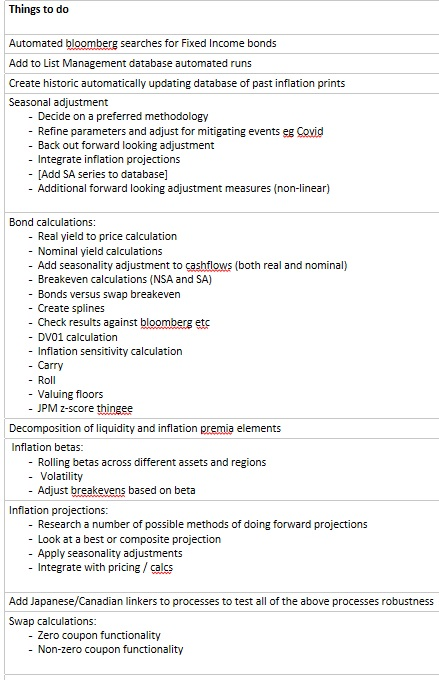
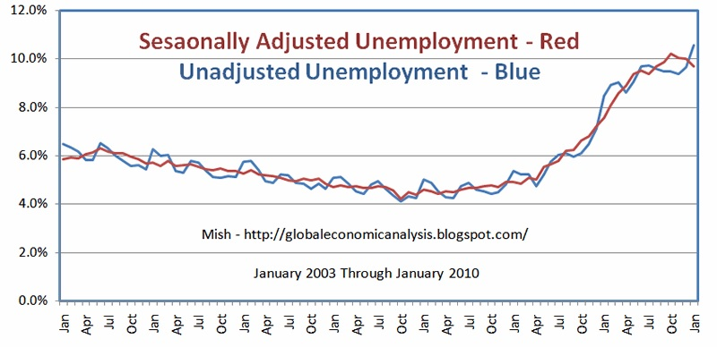

```{r setup, include=FALSE}
source("../data_import.R")
source("../seasonality_adjustment_cpi.R")

library(x13binary)
library(seasonal)

library(DBI)
library(dbConnect)
library(futile.logger)
library(lubridate)
library(RSQLite)
library(purrr)
library(tibble)
library(tidyverse)
library(zoo)

knitr::opts_chunk$set(echo = TRUE)
```

## Inflation tools project overview 

Part of workstreams on inflation work. Did a bit of an intro a couple of weeks ago at trade ideas `Markets v1 1480094`.  

All work is currently is currently in the following file: `N:\Offdata\RM\_R code repository\Inflation Proj\`.

I have a newer plan which I am working against below. This covers tools for all of the things previously discussed. The seasonality adjustment work is a building block for the future work. 

```{r echo=FALSE}

```

## Added to the list management database 

There are now a number of new lists in the list management database for inflation linked bonds from US, UK, DE, FR, IT and ES.  

```{r echo = FALSE}
linkers %>% select(-c(INFLATION_LAG, REFERENCE_INDEX)) 
```

Note, currently have not added JGBi linkers, saving these to test all the functionality at a later date. 


## Built an inflation database

A database of all of the inflation prints for inflation linked bonds. Updates everytime there is a new inflation print. Automatically adds new indicies 


```{r echo = FALSE}
inflation_past  %>% head()
```

These are the current series:

```{r echo = FALSE}
inflation_past  %>% distinct(inflation_index)
```


## What is seasonality?  

Seasonality is a characteristic of a time series in which the data experiences regular and predictable changes that recur every calendar year. Any predictable fluctuation or pattern that recurs or repeats over a one-year period is said to be seasonal. Seasonal effects are different from cyclical effects, as seasonal cycles are observed within one calendar year, while cyclical effects, such as boosted sales due to low unemployment rates, can span time periods shorter or longer than one calendar year. (Investopedia)

```{r pressure, echo=FALSE}
 
```

Why do we care: 

Because it effects inflation. 


## Built a couple of functions  

These can interact with a user inputed set of data but are also set up to run automatically on a series from the database. These all end `_db`. 

The functions are written to adjust series for seasonality and also should limit the impact of outliers (eg GFC, Covid) or trend shifts (eg structural difference due to one off event).  These can also be defined by the user as well to assit the automated processes. 

The X-13 ARIMA SEATS method is used. This is used elsewhere in the Bank and offers flexibility, automation of variable selection and robustness. 

The `monthplot` shows the changing trend in seasonality in different months over a number of years. The example below looks at US urban CPI. You can see that seasonality has become more pronouced since the 1980s.   


```{r fig.width=10}
monthplot_db("CPURNSA Index")
```

What might we want to adjust? A key series will be projected inflation. This will impact the pricing of inflation linked instruments. 


```{r}
twoyears_twopercent <- create_linear_unseasonal_proj_curve(annualised_inflation_percent = 2,
                                    base_level = 150,
                                    base_month = month(Sys.Date()),
                                    base_year = year(Sys.Date()),
                                    frequency = 12,
                                    proj_years = 3)

ggplot(data = twoyears_twopercent, aes(x = date, y = proj_infl, color = "red")) + geom_line()
```

A seasonal adjustment by month: 

```{r}
seasonality_adjustment_db("CPTFEMU Index") %>% mutate(month = month(month, label = TRUE))
```


We can then seasonally adjust our projections. This has implications for bond yields / prices, especially at very short maturities when the seasonality forms a greater part of the unexpected returns.   

```{r}
twoy_2perc_sa <- seasonality_adjust_projection_db(projected_curve = twoyears_twopercent, 
                                                  projected_index = "CPURNSA Index") %>%
  rename(SA = proj_infl) %>% select(-season_factor_cuml) %>%
  left_join(twoyears_twopercent, by = "date") %>%
  rename(NSA = proj_infl) %>% select(-season_factor_cuml) %>%
  pivot_longer(-date, names_to = "index_adj", values_to =  "proj_infl")

ggplot(data = twoy_2perc_sa, aes(x = date, y = proj_infl, color = index_adj)) + geom_line()
```


We can also compare the seasonality difference across countries. 

```{r echo=FALSE}
seasonality_adjustment_db("UKRPI Index") %>%
  rename(UK = seasonal_adjustment) %>%
  left_join(seasonality_adjustment_db("CPURNSA Index"), 
            by = "month") %>%
  rename(US = seasonal_adjustment) %>%
  left_join(seasonality_adjustment_db("FRCPXTOB Index"), 
            by = "month") %>%
  rename(FR = seasonal_adjustment) %>%
  left_join(seasonality_adjustment_db("CPTFEMU Index"), 
            by = "month") %>%
  rename(EU = seasonal_adjustment) %>%
  left_join(seasonality_adjustment_db("ITCPIUNR Index"), 
            by = "month") %>% 
  rename(IT = seasonal_adjustment) %>%
  pivot_longer(cols = -month, names_to = "country", values_to = "seasonal_adjustment") %>%
  ggplot(aes(x = month, y = seasonal_adjustment, colour = country)) +
    geom_line() +
    ylab("Seasonal adjustment") +
    xlab("") +
    scale_x_discrete(limits = c("Jan","Feb","Mar", "Apr", "May", "Jun", "Jul", "Aug", "Sep", "Oct", "Nov", "Dec"))
```

## Next steps 

Building this into bond pricing and breakevens. 


## References 

X-13 ARIMA seats documentation: `https://www.census.gov/ts/x13as/docX13ASHTML.pdf?sec_ak_reference=18.8b37b9d0.1592385777.1061dce4 `

Seasonal R package website: `http://www.seasonal.website/seasonal.html `

Internal seasonal adjustment markdown: `http://collaborate/workspaces/RHelpCentre/R%20Markdown/Seasonal_Adjustment_Wiki.html `

Internal presentation on adjustment: `Analytical v2 7852655`

## Contacts in other areas doing seasonality adjustments

Ross Meader, Charlie Nourse - DSD

Carleton Webb - MA 
 


