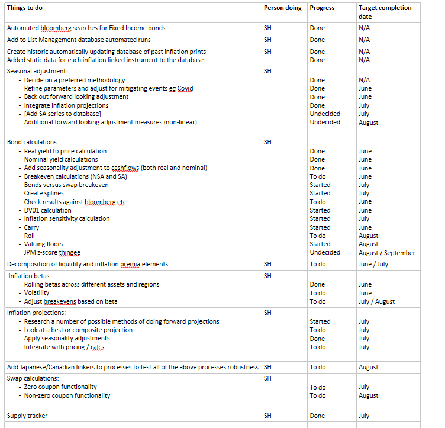

```{r setup, include=FALSE}
source("../beta_func.R")
#source("../data_import.R")
source("../implied_rates.R")
source("../linker_calculation.R")
source("../linker_supply.R")
source("../seasonality_adjustment_cpi.R")

library(x13binary)
library(seasonal)

library(DBI)
library(dbConnect)
library(futile.logger)
library(lubridate)
library(RSQLite)
library(purrr)
library(tibble)
library(tidyverse)
library(zoo)

knitr::opts_chunk$set(echo = TRUE)
```

## Inflation tools project overview 

Part of workstreams on inflation work. This is the second update:
* did  a bit of an intro start of June  `Markets v1 1480094`.  
* then a updated that focussed on seasonality.

The second update alongisde all the current code work is currently is currently in the following file: `N:\Offdata\RM\_R code repository\Inflation Proj\`.

I've updated the project plan that I showed previously, progress has generally been good. There are a couple of new elements on the plan that weren't there last time. 

The plan covers tools for all of the ideas that were brainstormed previously plus extras from the literature. The overall project is a little bit like building blocks in the sense that some segments are required to do others. 

```{r echo=FALSE}

```

## What had been done previously 

Previously I had:
* built a new database  of inflation prints (US, UK, DE, FR, IT and ES)
* added new bonds to the list management database
* built fucntions for seasonal adjustment 
* built a linear curve projection

The graph below shows the seasonal adjustments for a couple of regions in the database by month, using the latest data.  

```{r echo = FALSE}
seasonality_adjustment_db("UKRPI Index") %>%
  rename(UK = seasonal_adjustment) %>%
  left_join(seasonality_adjustment_db("CPURNSA Index"), 
            by = "month") %>%
  rename(US = seasonal_adjustment) %>%
  left_join(seasonality_adjustment_db("CPTFEMU Index"), 
            by = "month") %>%
  rename(EU = seasonal_adjustment) %>%
  pivot_longer(cols = -month, names_to = "country", values_to = "seasonal_adjustment") %>%
  ggplot(aes(x = month, y = seasonal_adjustment, colour = country)) +
    geom_line() +
    ylab("Seasonal adjustment") +
    xlab("") +
    scale_x_discrete(limits = c("Jan","Feb","Mar", "Apr", "May", "Jun", "Jul", "Aug", "Sep", "Oct", "Nov", "Dec"))
```

## What has been done since then 

The progress has been split across a number of fronts:

* adding more functionality to the database, primarilys static data for all of the different linkers 

* using bloomberg to quickly get market implied inflation curves

* combine both of the above to do bond calculations 

* functions to quick generate rolling betas for metrics across flexible windows and time periods 

* generate supply time series and charts for inflation linked markets 


## Glossary 
 
`_db` being used to indicate that the internal (N: Drive) databases are being used.  
 
`nominal` is generally used to desribed fixed coupon securities issued by the sovereign. 

`plot_` will produce a plot. This is normally best used as a wrapper round an output from another function or function output. 

`SA` and `NSA` stand for seasonally adjusted ot non-seasonally adjusted respectively.

`_ts` being used to indicate time series. 


## More data in the database

Static data for all the inflation linked bonds in the list manager. Updates everytime there is a new inflation linked bond issued (daily job).  


```{r echo = FALSE}
linker_static_db(c("US912810FH69")) %>% select(-c(CPN_FLOOR, DEFLATION_FLOOR_INDICATOR))
```


## Getting the market implied inflation curve

The below function get the market implied inflation swap curve 

```{r }
curve <- swap_implied_inflation_data(c("CPURNSA Index", "UKRPI Index"))

head(curve)                              
```

This can then be turned into the inflation index curve,

```{r }
implied_index <- implied_proj_inflation_curve(implied_curve = curve %>%
                                                               select(-`UKRPI Index`) %>%
                                                               rename(implied_infl = `CPURNSA Index`),
                                              base_level = 256)
head(implied_index)
```

and then seasonally adjusted:

```{r echo=TRUE}
seasd <- seasonality_adjust_projection_db(implied_index, "CPURNSA Index", proj_is_SA = TRUE)
seasd
```
Plotted: 
```{r echo=FALSE}
seasd %>% rename(proj_infl_nsa = proj_infl) %>% select(-season_factor_cuml) %>%
  left_join(implied_index, by = "date") %>% select(-season_factor_cuml) %>% filter(date <= "2025-06-01") %>%
  plot_ly(x = ~date, y = ~proj_infl_nsa, type = "scatter", mode = "lines", name = "NSA Implied Inflation Index") %>%
    add_trace(x = ~date, y = ~proj_infl, type = "scatter", mode = "lines", name = "SA Implied Inflation Index")
```


## Bond calculations

Combining all of the above it is possible to do calculations on the cashflows of bonds and work out a host of other useful statistics

Again all of the below functions can be run not using ISINs and the connected database. You might want to do this in the case of a new issue, for example. 

Inflation linked cashflows based on the projected curve can be shown as follows: 

```{r echo=FALSE}
lm_database_path = "N:/Offdata/RM/_Data/ListManagement/list_membership.db"
infl_database_path = "N:/Offdata/RM/_Data/Inflation/inflation.db"
  
linker_static <- linker_static_db(bond_ISIN = "US9128284H06",
                                    lm_database_path = lm_database_path,
                                    infl_database_path = infl_database_path)
cashflows <- cashflow_table(maturity_date = linker_static$MaturityDate,
                               coupon = linker_static$coupon,
                               payment_frequency = linker_static$payment_frequency,
                               ref_date = Sys.Date(),
                               settle_convention = linker_static$settle_convention,
                               day_count = linker_static$day_count)  

infl_conn <- dbConnect(SQLite(), infl_database_path)
inflation_past <- dbGetQuery(infl_conn, "SELECT * FROM inflation_indices") %>%
    mutate(date = as_date(date)) %>%
    filter(inflation_index == "CPURNSA Index") %>%
    select(date, index_value) %>%
    filter(date > "2020-01-01")
dbDisconnect(infl_conn)  

infl_curr <- seasonality_adjust_projection_db(
  implied_proj_inflation_curve(implied_curve = swap_implied_inflation_data("CPURNSA Index") %>%
                                                               rename(implied_infl = `CPURNSA Index`),
                                              base_level = inflation_past %>%
                               filter(date == max(date)) %>%
                               pull(index_value),
                             base_month = inflation_past %>%
                               filter(date == max(date)) %>%
                               pull(date) %>%
                               month() + 1,
                             base_year = inflation_past %>%
                               filter(date == max(date)) %>%
                               pull(date) %>%
                               year()
                            ),
  "CPURNSA Index",
  proj_is_SA = TRUE) 
projected_inflation_curve <- inflation_past %>%
  filter(date != max(date)) %>%
  rename(proj_infl = index_value) %>%
  rbind(infl_curr %>% select(-season_factor_cuml))
  
linker_cashflow_table(cashflow_table = cashflows,
                                                 projected_inflation_curve = projected_inflation_curve,
                                                 reference_cpi = linker_static$reference_cpi,
                                                 settle_convention = linker_static$settle_convention,
                                                 inflation_lag = linker_static$inflation_lag,
                                                 principal_floor = linker_static$principal_floor,
                                                 coupon_floor = linker_static$coupon_floor)

```


The main function is `linker_info` and `linker_info_db`. These give a summary of the bond (similar to YAS) but based on the inputted implied 

```{r echo=TRUE}
info <- linker_info_db(bond_ISIN = "US9128284H06", 
               projected_inflation_curve = projected_inflation_curve,
               real_yield = -0.998)
info
```

There are numerous functions that can be used to find specific values, and might be quicker in the case that you want to work out one statistic for a large number of bonds, or do something like a scenario analysis. For example the `linker_dv01_price` function will likely be built into the daily dashboard calculations. 

A non-exhaustive list of examples:

* `linker_cashflow_table`, a table of non-inflation ("real") cashflows
* `linker_convexity_price`, linker convexity based on the price
* `linker_dv01_yield`, linker DV01 based on the real_yield
* `linker_iv01_yield`, linker price sensivity to a 1bp point parallel shift in the inflation curve on the real_yield
* `linker_price_db`, calculates the linker price for the real yield using the static information from the database

As you might have guessed for every `_yield` function there is an equivilant `_price` function. There is almost always a `_db` function too. 

## Rolling betas
 
These are more generic functions for finding the beta 

The function `calc_beta_ts_bloomberg` has two window style varibales:

* `window` is the time horizon of rolling window for the beta in days, eg 130 would be roughly 6 months
* `change_window` is the time horizon for the change measurement, eg 5 would be a weekly change, 22 a monthly 

There is also a number of different `method`s for the function:

* `change` the difference in value
* `percent_change` the percentage change in value, less useful when a series has postive and negative values
* `log_change` the natural log of the change in value, effective for transfering a multiplicative relationship to an additive one, doesn't work with negative values
* `level` the relative level of the actual values
* `log_level` the relative level of the natural log of the values, useful for turning a exponential relationship into a linear one, doesn't work with negative values

The example below shows the rolling 3-month realtionship of the weekly moves in US oil (WTI) prices versus inflation expectations derived from the difference in US treasury nominal and linker yields, the "breakeven". 
 

```{r echo=TRUE}

US_oil_beta <- calc_beta_ts_bloomberg("USGGBE03 Index", "PX_LAST",
                                      "CL1 Comdty", "PX_LAST",
                                      from_date = Sys.Date() - 720,
                                      window = 90,
                                      method = "change",
                                      change_window = 5,
                                      include_r2 = TRUE)
head(US_oil_beta)
```


There is also a function for inputting your own series, `calc_beta_ts`, as the independant & dependant variables.   

This can then be quickly plotted: 

```{r}
plot_beta_ts(US_oil_beta)
```

There is the option to also plot the intercept, `include_intercept`,  this will plot the rolling intercept on a second y-axis. This can be helpful for guaging if there is a large level shift.

Another example, the relationship between nominal yields and breakeven yields has collapsed in the US (and EU): 


```{r echo=TRUE}

plot_beta_ts(calc_beta_ts_bloomberg("USGGBE03 Index", "PX_LAST",
                                      "GT3 Govt", "YLD_YTM_MID",
                                      from_date = Sys.Date() - 720,
                                      window = 90,
                                      method = "change",
                                      change_window = 5))

```

## Supply information

Finally, working off the list manager database, the code checks all issues of every bond.

First there is a time series that has a number of metric to measure issuance:

```{r echo=TRUE}
UK <- infl_link_supply_ts_db("UK")

head(UK)
```

I have created two ploting functions to quickly display this data in easy to understand. The series can also be used for other purposes such as regression analysis, with the data allowing easy maturity calculation and a duration neutral measure `dv01`.  

### Monthly issuance by year
```{r echo=TRUE}
plot_monthly_supply(UK, start_date = "2017-01-01")
```

### Maturity bucket of issuance by year 

```{r echo=TRUE}
plot_supply_maturity(UK, start_date = "2017-01-01")
```

Caveat: going back further than 4 years as it does not look at matured issuance as the ISINs are not in the list manager database. Linkers are generally not issued at less than 3 years due to lack of inflation projection. So this provides a buffer. I will look at expanding this code to look at any list of ISINs. Also I might add a table of historical issuance to the database. 

## Next steps 

Currently at over 40 functions. 

Building the seasonality work into the bond calculations, and building out time series (past and present) for breakeven rates based on these calculations


## References 

Barclays Inflation Handbook

Bloomberg


