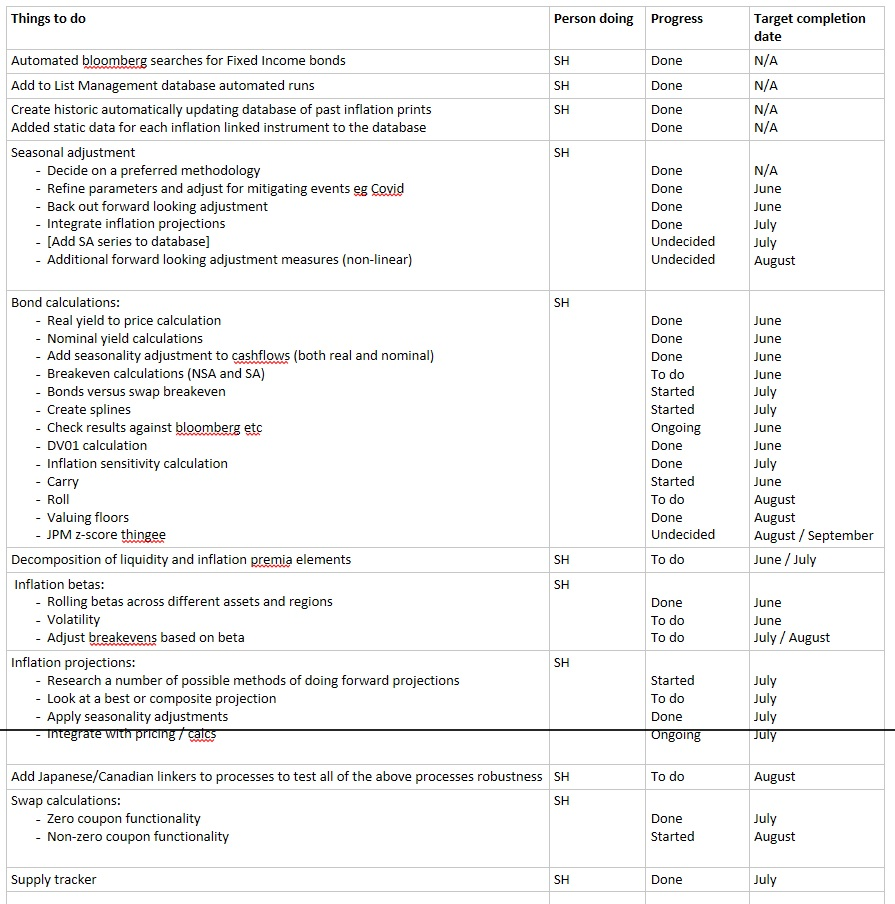
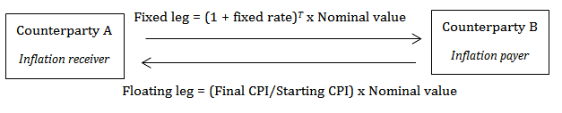

```{r setup, include=FALSE}
source("../beta_func.R")
#source("../data_import.R")
source("../floor_valuation.R")
source("../inflation_db_functions.R")
source("../inflation_swaps.R")
source("../implied_rates.R")
source("../linker_calculation.R")
source("../linker_supply.R")
source("../seasonality_adjustment_cpi.R")

library(x13binary)
library(seasonal)

library(DBI)
#library(dbConnect)
library(futile.logger)
library(lubridate)
library(RSQLite)
library(purrr)
library(tibble)
library(tidyverse)
library(zoo)

knitr::opts_chunk$set(echo = TRUE)
```

## Inflation tools project overview 

Part of workstreams on inflation work. This is the third update:

* did  a bit of an intro start of June  `Markets v1 1480094`.  

* then a updated that focussed on seasonality.

* then did an update on tools (bond pricing, supply, betas).  

This third update alongisde all the current code work is currently is currently in the following file: `N:\Offdata\RM\_R code repository\Inflation Proj\`.

I've updated the project plan (below) that I showed previously, progress has generally been good, although I didn't look at it so much over the summer. There are a couple of new elements on the plan that weren't there last time. I've also got a slightly more deatiled list of things to go back to / think about in the file.

The plan is meant to covers tools for all of the ideas that were brainstormed previously plus extras from the literature. The overall project is a little bit like building blocks in the sense that some segments are required to do others. Definately see this in the code of some of the later 

```{r echo=FALSE}

```

## What had been done previously 

Previously I had:

* built a new database  of inflation prints (US, UK, DE, FR, IT and ES), and added to the list management database

* built functions for seasonal adjustment and applied them to projected curves (both linear and market implied)

* functions for bond pricing 

* graphing supply and betas 

The example below shows the rolling 3-month realtionship of the weekly moves in US oil (WTI) prices versus inflation expectations derived from the difference in US treasury nominal and linker yields, the "breakeven". 
 

```{r echo=TRUE}

US_oil_beta <- calc_beta_ts_bloomberg("USGGBE03 Index", "PX_LAST",
                                      "CL1 Comdty", "PX_LAST",
                                      from_date = Sys.Date() - 720,
                                      window = 90,
                                      method = "change",
                                      change_window = 5,
                                      include_r2 = TRUE)
head(US_oil_beta)
```


## What has been done since then 

The progress been more focussed in a couple of areas since last time:

* added inflation sensitivity to bond pricing  

* built a zero copoun swap valuer / function (and started on one for)

* tried to value floors in linkers  

## Glossary 
 
`_db` being used to indicate that the internal (N: Drive) databases are being used.  
 
`nominal` is generally used to desribed fixed coupon securities issued by the sovereign. 

`plot_` will produce a plot. This is normally best used as a wrapper round an output from another function or function output. 

`SA` and `NSA` stand for seasonally adjusted ot non-seasonally adjusted respectively.

`_ts` being used to indicate time series. 


## Linker calculations

Last time showed the calculations for inflation linked bonds on the cashflows of bonds and work out a host of other useful statistics

All of the below functions can be run not using ISINs and the connected database. One case where you might want to be able to do bespoke calculations is in the case of a new issue. 

Inflation linked cashflows based on the projected curve can be shown as follows: 

```{r echo=FALSE}
lm_database_path = "N:/Offdata/RM/_Data/ListManagement/list_membership.db"
infl_database_path = "N:/Offdata/RM/_Data/Inflation/inflation.db"
  
linker_static <- linker_static_db(bond_ISIN = "US9128284H06",
                                    lm_database_path = lm_database_path,
                                    infl_database_path = infl_database_path)

cashflows <- cashflow_table(maturity_date = linker_static$MaturityDate,
                               coupon = linker_static$coupon,
                               payment_frequency = linker_static$payment_frequency,
                               ref_date = Sys.Date(),
                               settle_convention = linker_static$settle_convention,
                               day_count = linker_static$day_count)  

infl_conn <- dbConnect(SQLite(), infl_database_path)
inflation_past <- dbGetQuery(infl_conn, "SELECT * FROM inflation_indices") %>%
    dplyr::mutate(date = as_date(date)) %>%
    dplyr::filter(inflation_index == "CPURNSA Index") %>%
    dplyr::select(date, index_value) %>%
    dplyr::filter(date > "2020-01-01")
dbDisconnect(infl_conn)  

infl_curr <-  implied_proj_inflation_curve(implied_curve = swap_implied_inflation_data("CPURNSA Index") %>%
                                                               rename(implied_infl = `CPURNSA Index`),
                                              base_level = inflation_past %>%
                               dplyr::filter(date == max(date)) %>%
                               dplyr::pull(index_value),
                             base_month = inflation_past %>%
                               dplyr::filter(date == max(date)) %>%
                               dplyr::pull(date) %>%
                               month() + 1,
                             base_year = inflation_past %>%
                               dplyr::filter(date == max(date)) %>%
                               pull(date) %>%
                               year()
                            )

projected_inflation_curve <- inflation_past %>%
  dplyr::filter(date != max(date)) %>%
  dplyr::rename(proj_infl = index_value) %>%
  rbind(infl_curr %>% select(-season_factor_cuml))
  
linker_cashflow_table(cashflow_table = cashflows,
                                                 projected_inflation_curve = projected_inflation_curve,
                                                 reference_cpi = linker_static$reference_cpi,
                                                 settle_convention = linker_static$settle_convention,
                                                 inflation_lag = linker_static$inflation_lag,
                                                 principal_floor = linker_static$principal_floor,
                                                 coupon_floor = linker_static$coupon_floor)

```


The main function is `linker_info` and `linker_info_db`. These give a summary of the linker (similar to YAS or the bond function in the RQuantlib package) based on the inputted implied curves.

You'll now see that there is an IV01 statistic at the bottom of this list. This could be thought of as a Inflation DV01, and is the sensitvity of the bond to a one basis point parallel shift in the implied inflation rate curve over the maturity of the bond. It is dependant on the level of the curve to an extent in the same way that the DV01 is, but given it is realtively range bound, people don't appear to think about inflation convexity. 


```{r echo=TRUE}
info <- linker_info_db(bond_ISIN = "US9128284H06", 
               projected_inflation_curve = projected_inflation_curve,
               real_yield = -1.138)

info
```

Previosuly I had built numerous functions that can be used to find specific values, and might be quicker in the case that you want to work out one statistic for a large number of bonds, or do something like a scenario analysis. For example `linker_dv01_price` function will likely be built into the daily dashboard calculations. I am considering rolling these back because although mainly built on the underlying set of functions they are generally more difficult ot maintain in longer term. In the case that one specific 

## Zero copoun swap 
 
Similar to the bond above, I have made a zero coupon swap function. This works in a similar way, although there is no `_db` equivalent as the instruments are non-standardised. 

It is set up for the most common type at the moment but I need to add another day count style at some point in the future.   

A xero coupon inflation swap has only one realised cashflow, at maturity, to whichever of the fixed coupon or inflation reciever is in the money.

```{r}

```

 

```{r echo=TRUE}
zero_coupon_inflation_swap(start_date = Sys.Date() + 2,
                           maturity_date = as.Date("2024-07-24"),
                           notional = 10000000,
                           fixed_rate = 0.5,
                           inflation_lag = 3,
                           reference_cpi = 256,
                           payment_frequency = 1,
                           projected_inflation_curve = infl_curr,
                           interpolation = "monthly",
                           day_count = "ACT/ACT"
                           )
```


## Linker principal floors


```{r echo=TRUE}
floor_valuation_db("FR0012558310")
```

```{r echo=TRUE}
floor_valuation_db("US9128284H06")
```

## Next steps 

Completing the swaps to allow linker ASW calculations.

Was thinking of doing a code review at some point. 

Building out time series (past and present) for breakeven rates based on these calculations


## References 

Barclays Inflation Handbook

Bloomberg


